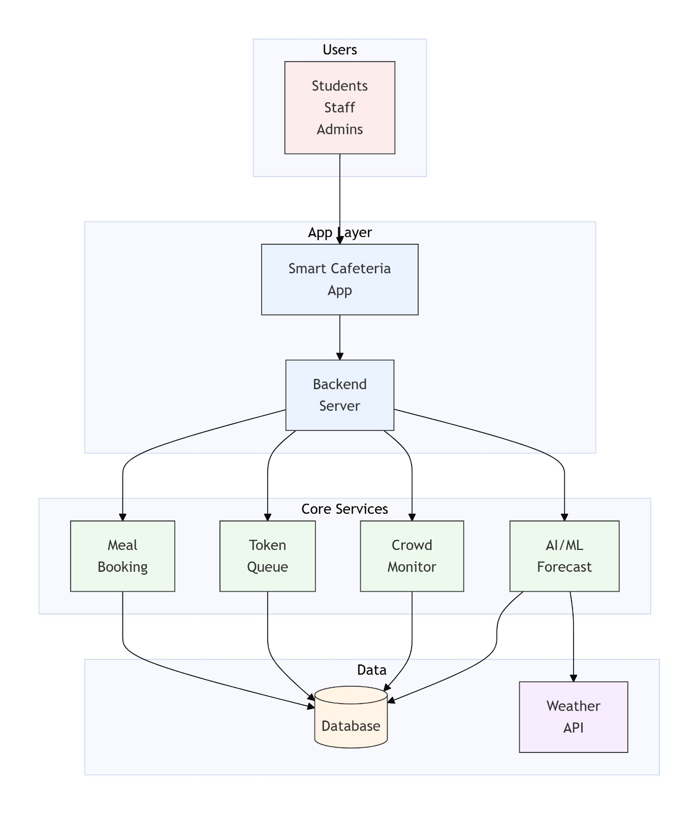

# Smart Cafeteria Management System

[](https://github.com/SuryaSampreeth/smart-cafeteria-web-deployment/actions/workflows/ci-backend.yml)
[](https://github.com/SuryaSampreeth/smart-cafeteria-web-deployment/actions/workflows/ci-frontend.yml)
[](https://github.com/SuryaSampreeth/smart-cafeteria-web-deployment/actions/workflows/deploy.yml)

## Table of Contents

- [Overview](#overview)
- [System Architecture](#system-architecture)
- [Deployment Tech-Stack](#deployment-tech-stack)
- [Technology Stack](#technology-stack)
- [Project Folder Structure](#4-project-folder-structure)
- [Project Architecture](#project-architecture)
- [Getting Started](#getting-started)
  - [Backend Setup](#backend-setup)
  - [ML Service Setup](#2-ml-service-setup-full-stackbackend-roles)
  - [Frontend Setup](#3-frontend-setup)
- [CI/CD Pipeline](#cicd-pipeline)
- [Branch Strategy](#branch-strategy)
- [Monitoring & Logging](#monitiring--logging)
- [API Endpoints](#api-endpoints)
- [Live Deployments](#live-deployments)
- [Contributing](#contributing)
- [License](#license)

## Overview
The Smart Cafeteria Management System is a full-stack application that enables students to pre-book meals, track queue status, and manage orders efficiently.

The system provides role-based access for:

Students – Meal booking and order tracking

Staff – Queue and order management

Administrators – Menu management and analytics

The project is deployed using modern DevOps practices, including automated CI/CD pipelines, cloud hosting.


## System Architecture
### Frontend Service

React Native (Expo Go)

- Hosted on Vercel

- Provides UI for students, staff, and administrators

### Backend API Service

- Node.js + Express REST API

- Hosted on Render

- Handles authentication, bookings, queue management, and analytics

### ml_service API

- Python + Flask

- Hosted on Render

- Performs crowd prediction and demand forecasting

### Database Layer

- MongoDB Atlas cloud database

- Stores users, bookings, menus, and analytics data

## Deployment Tech-Stack
 This project uses cloud-managed services to ensure scalability and reliability.


| Layer | Technology |
| :--- | :--- |
| **Frontend** | Vercel | Hosting React Native EXPO Go |
| **Backend** | Render | Node.js REST API |
| **ML Service** | Render | Python ML |
| **Database** | MongoDB Atlas | cloud database | 
| **Dev Tools** | GitHub Actions | Automated build, test, deploy | 

## Technology Stack

### Backend
- Node.js

- Express.js

- MongoDB with Mongoose ODM

- JWT Authentication

- bcryptjs password hashing

- dotenv environment management

- express-validator input validation

### Frontend
- React Native with Expo

- React Navigation

- React Context API

- Axios HTTP client

- react-native-chart-kit

### ML Service
- Python

- Flask

- Pandas

- Scikit-learn

- TensorFlow

### DevOps & Deployment
- GitHub Actions

- Vercel

- Render

- MongoDB Atlas

## 4. Project Folder Structure

```text
smart-cafeteria/
│
├── frontend/                # React Native Mobile Application
│   ├── src/
│   │   ├── components/      # Common & Feature-specific UI
│   │   ├── screens/         # Organized by Student, Staff, Admin
│   │   ├── context/         # Auth & Global State management
│   │   ├── navigation/      # Stack & Tab based routing
│   │   └── services/        # Axios API service layer
│
├── backend/                 # API Server & Business Logic
│   ├── controllers/         # Logic for Auth, Booking, Crowd, Menu
│   ├── routes/              # API Endpoints mapping
│   ├── models/              # MongoDB/Mongoose Schemas
│   ├── services/            # Background Workers (Crowd Tracking, Alerts)
│   ├── utils/               # Token generation & Queue Managers
│   ├── ml_service/          # Python/Flask Machine Learning Hub
│   │   ├── app.py           # ML API Entry Point (Port 5001)
│   │   ├── models/          # Trained Model Binaries (XGBoost, LSTM)
│   │   └── data/            # Processed Datasets
│   └── server.js            # Node.js Application Entry Point (Port 5000)
│
└── QUICKSTART.md            # Rapid setup instructions
```

## Project Architecture


## Getting Started
###Backend Setup

```bash
cd backend
npm install
# Configure .env with MONGODB_URI and JWT_SECRET
npm run seed  # Create admin & initial slots
npm run dev   # Start Node server on port 5000
```

#### **2. ML Service Setup (Full-Stack/Backend Roles)**
```bash
cd backend/ml_service
pip install -r requirements.txt
python app.py  # Start ML API on port 5001
```

#### **3. Frontend Setup**
```bash
cd frontend
npm install
# Set EXPO_PUBLIC_API_URL in .env to your Local IP
npx expo start
```

## CI/CD Pipeline
This project uses GitHub Actions for automated testing and deployment.
Pipeline Workflow


### Code Push / Pull Request

### Continuous Integration
- Backend tests

- ML service tests

- Frontend build validation

### Build Stage

- Install dependencies

- Run lint checks

### Deployment Stage

- Backend deployed to Render

- ML service deployed to Render

- Frontend deployed to Vercel

## Branch Strategy
- main: Production branch (auto deployment)


## Monitiring & Logging
- Monitoring is handled using platform dashboards
- Render Logs → Backend and ML runtime logs

- Vercel Analytics → Frontend deployment monitoring

- GitHub Actions Logs → CI/CD pipeline logs


## API Endpoints
### Authentication

- POST `/api/auth/register`
- POST `/api/auth/login`

### Bookings

- GET `/api/bookings`
- POST `/api/bookings`
- PUT `/api/bookings/:id`
- DELETE `/api/bookings/:id`

### Menu

- GET `/api/menu`
- POST `/api/menu`
- PUT `/api/menu/:id`
- DELETE `/api/menu/:id`

### Staff

- GET `/api/staff/orders`
- PUT `/api/staff/orders/:id`

### Admin

- GET `/api/admin/stats`
- GET `/api/admin/users`
- PUT `/api/admin/users/:id`


## Live Deployments
### Frontend
Platform: **Vercel**  
https://smart-cafeteria-web-deployment.vercel.app/

### Backend
Platform: **Render**  
https://backend-api-rxpg.onrender.com/api

### ML Service
Platform: **Render**  
https://ml-service-azkv.onrender.com/

## Contributing

Contributions are welcome! Please follow these steps:

1. Fork the repository
2. Create a feature branch (git checkout -b feature/YourFeature)
3. Commit your changes (git commit -m 'Add YourFeature')
4. Push to the branch (git push origin feature/YourFeature)
5. Open a Pull Request

## License

This project is licensed under the MIT License.
